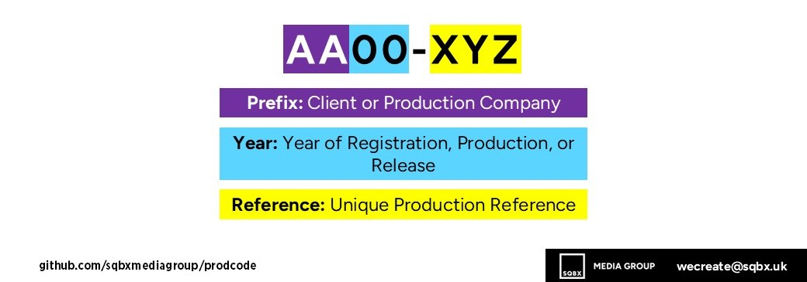
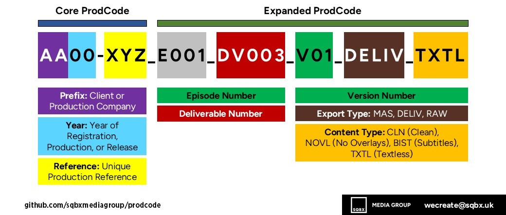

# ProdCode V3 Specification

ProdCode is SQBX's production coding system for media projects.

V3 is the current working version of ProdCode.

## ProdCode Allocation

A 'ProdCode' is issued to each individual project.

This includes:

* Standalone Projects
* Single Series
* Separate Episodes (where necessary)

For projects that have multiple series, each individual series will have its own unique ProdCode allocated.

## Code Format

`AA00-XYZ`

The core 'ProdCode' is comprised of:

* `AA`: Production Company or Client Prefix
* `00`: Year of Registration, Production, or Release
* `XYZ`: Unique Production Reference

### Production Company Prefix

**The "Production Company" prefix incidates the registered company that is taking ownership of the production. It must be 2 uppercase alphabetic characters, A-Z.**

Production Companies can hold multiple prefixes with SQBX, and are often used to separate by brand, or to allow for more codes.

For example, Company A can own the prefixes `AA` and `AB`.

In the event of a co-production, the main production company's prefix should be used. Otherwise, a new company can be registered for that specific production with a new prefix.

### Production Year

**The "Production Year" can refer to the project's registration, production, or release year. It must be 2 numeric characters, 0-9.**

For example, for the year 2024, the value used would be `24`.

The preference is to use the 'registration year', that is the year the project is entered into the project management system.

However, if a project has a set production or release year, it may be more appropriate to use that value.

### Production Reference

**The "Production Reference" is a quick way of identifying the project. It must be three characters.**

The reference is not unique, but it cannot be re-used by the same production company (across all registered prefixes) within the same 2 years.

For example, `AA23-XYZ` and `AA24-XYZ` is not permitted, but `AA23-XYZ` and `AA25-XYZ` is acceptable, where `XYZ` is the reference.

There are three patterns that the reference can use:

* `XYZ`: Three alphabetic characters (most common)
* `A00`: One alphabetic character followed by two numeric characters
* `AA0`: Two alphabetic characters followed by one numeric character

The reference must follow one of the patterns above and cannot start with a numeric character.

## Nesting

For related projects, the media/project management system should allow for nesting and linking.

The main way to do this is by setting a 'parent project'.

You can either register a new, blank project; or, you can link one project to another directly.

This system of nesting will only allow for one step, so you cannot create a chain of links. However, many projects can have the same parent project.

This is particularly useful for creating spin-off projects or linking different series of the same production.

## Relative Projects

If a related project is not a direct spin-off or does not need to be nested, it can be made a 'relative project' instead.

Example 1: you have a TV series registered with ProdCode  `SQ25-ABC`, and you have episode 1 registered with ProdCode `SQ25-ABF` nested underneath it. You want to create a new ProdCode `SQ25-ABX` for a variation of episode 1 (not a different 'version'). You could make the series the parent project and 'relate' it to the episode `SQ25-ABF`.

However, this may not be necessary in most circumstances.

Example 2: you have deliverables to create for the series `SQ25-ABC` that are not tied to a specific episode (such as a series trailer, social media clips, etc). Unless you need to create a separate code dedicated to just series deliverables, you can instead register them under the parent series ProdCode `SQ25-ABC`.

## Expanded ProdCode

The base ProdCode can be expanded to differentiate between specific versions and deliverables.

The Expanded ProdCode allows for multiple segments to be added, so you can use a mixture of elements to uniquely identify items.

### Episodes

You have two options for issuing ProdCodes to episodes:

* Issue a separate unique ProdCode, with the series ProdCode set as the parent (preferred)
* Issue an Expanded ProdCode with an episode identifier: e.g. `AA00-XYZ_E001`

It is recommended to use a separate ProdCode for each episode, but for longer-running series, an Expanded ProdCode may be preferred.

### Deliverables

Deliverables can be attached to any ProdCode, whether that is a series, episode, or standalone.

The suffix `DV001` can be added to signify a deliverable.

Example: `AA00-XYZ_DV001`

An export type should also be added to identify a deliverable sequence as being the master (e.g. `AA00-XYZ_DV001_V01_MAS`) or the deliverable file given to the client (e.g. `AA00-XYZ_DV001_V01_DELIV`).

### Versioning

A version number can be included with an Expanded ProdCode. It should be a `V` followed by two numeric digits, starting at `01`.

It is the production company / commissioner's discretion as to whether the version number increments after a technical re-delivery or after an editorial re-delivery.

Example: `AA00-XYZ_V01`

### Export Type

The export type is used to identify and distinguish different exports from one another. For most projects, a master (`MAS`) and a deliverable (`DELIV`) is produced.

The options are:

* `_MAS` (master file, can alternatively be referred to as `_MAIN`)
* `_DELIV` (deliverable file)
* `_RAW` (raw file, usually rushes or sync feeds)

Example: `AA00-XYZ_V01_MAS`

A project can have multiple exports of each type. You may wish to further distinguish these further by adding a reference / item name suffix.

### Content Type

The content type can be added to signify a particular type of export, such as textless.

The common options are:

* `_TXTL` (textless - no text or graphics)
* `_BIST` (burnt-in subtitling)
* `_CLN` (clean - an export with no additional graphics. Sometimes used for projects that usually have a burnt-in logo or watermark)
* `_NOVL` (no overlays - typically relevant for projects with graphics, like donation call-to-action)

Example: `AA00-XYZ_V01_MAS_CLN`

A master export with multiple of these elements, such as textless elements at the end of the file, may not require a content type. The contents of the file should be made clear in the VT clock at `09:59:50:00` and in the VT clock before the start of such variations.

### Reference Item Name Suffix

Most of the Expanded ProdCode segments listed above should allow you to differentiate between items without uncertainty. However, some situations may call for an additional identifier.

For example, if you are building draft versions, you may wish to add `_DRAFT_2025-01-01` to the end of the file name.

Or, if you are creating non-final items, such as 'sync feeds', you might wish to add `_SYNC_FEED_CAM01` to the end of the file name.

There is no set list for types of suffix you can use, but it's recommended that you keep file names short where possible to prevent issues.

## Contacts

If you have any questions about ProdCode, please contact SQBX: [wecreate at sqbx dot uk](mailto:wecreate@sqbx.uk).
This page was published 07 September 2025. This is ProdCode version 3.
